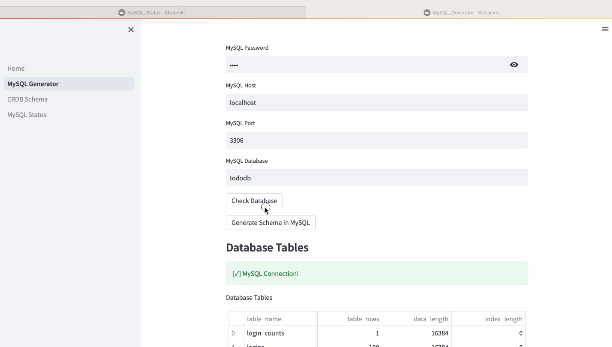

# Database Demos

The purpose of this code is to quickly seed DBs required for test/demo purposes, not for production.

Sample UI that generates 3 tables:
* Users
* Logins
* Count Logins
  * Store Procedure to count logins and insert into count_logins

**NOTE:** A minor bug shows up in streamlit when re-creating the MySQL Schema, to bypass, just click on MySQL Status page and that allows for the Delete stuck process to continue. Working on the fix.

* MySQL to CockroachDB (Cockroach Cloud provides a migration tool)

